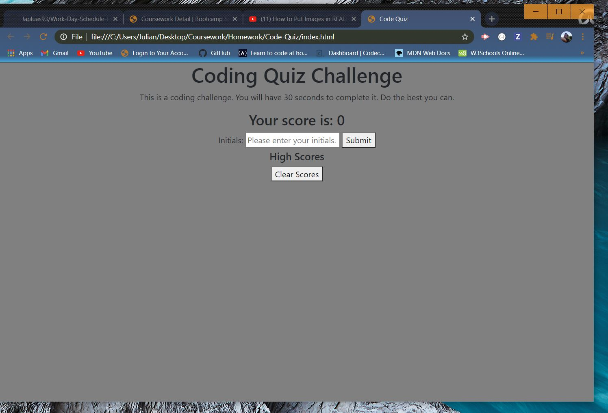

# Code-Quiz

Hi there. This is a simple coding quiz application. This is to test your knowledge of coding and the types and uses of different technologies When you get an answer wrong, the amount of time you have will be deducted. After you complete the quiz the application will request the user input their initials and their score (your time) will be displayed. 

This assignment was not easy by any means. One thing that made this assignment challenging was that there weren't very many activities from the previous weeks that could be directly applied. n a more positive note, one skill that I was able to improve on was learning how to breakdown a set of instructions. One of the TAs, Matt, was showing me how to do this earlier this week when we were reviewing one of the class activities.This assignment did not include any starter code, so it was imperative that I look at every step individually and try to understand what the end goal was. Overall, the challenge was fun. Happy coding.
